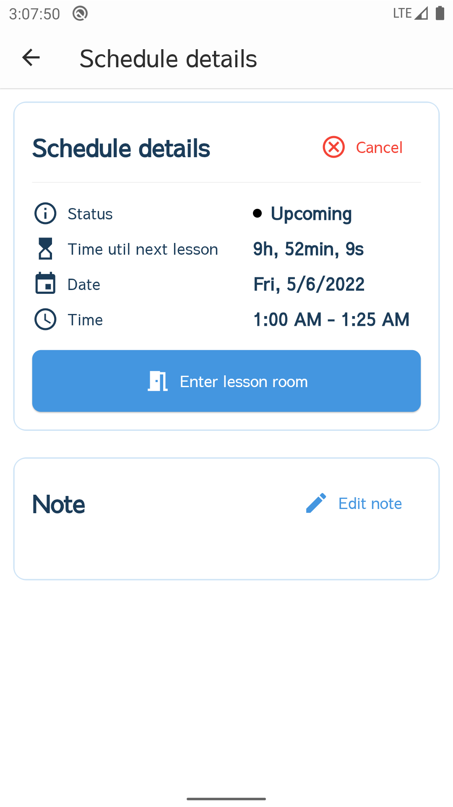
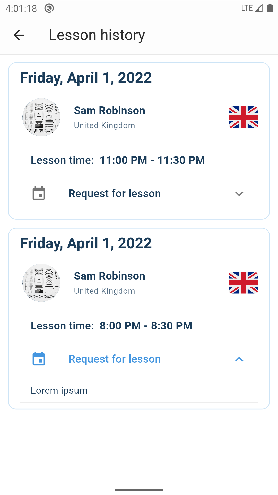
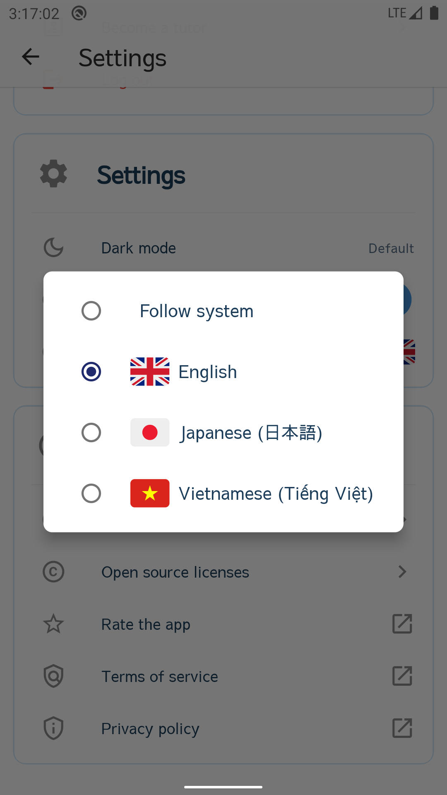

# Online tutor


## Video báo cáo

* [Milestone-1: Mock-up UI](https://youtu.be/npJajNlE9GA)
* [Milestone-2: Offline app](https://youtu.be/hupcssQtcow)
* [Milestone-3: Online app](https://youtu.be/RUMDlULfYBY)

## Thiết lập & xây dựng ứng dụng

**Sử dụng Flutter phiên bản `2.10.5` để chạy project**

*(Không sử dụng Flutter `3.0` hoặc mới hơn vì một số plugin, dependency mà project sử dụng chưa được cập nhật theo các
thay đổi của Flutter phiên bản mới).*

### Android

#### Thêm chữ ký số để chạy ứng dụng bản `prod` (production)

_Có thể bỏ qua bước này nếu chỉ cần build ứng dụng bản `dev` hoặc `mock`._

Xem thêm quy trình thêm chữ ký cho ứng dụng flutter trên android
tại: [Build and release an Android app](https://docs.flutter.dev/deployment/android#signing-the-app).

Tạo tập tin có tên `key.properties` bên trong thư mục `flutter_online_tutor/android/` có chứa thông tin chữ ký:
```
storePassword=<store password>
keyPassword=<key password>
keyAlias=<key alias>
storeFile=<location of the key store file, such as /Users/<user name>/upload-keystore.jks>
```

#### Thiết lập chức năng: Đăng nhập bằng google

_Có thể bỏ qua bước này nếu không cần sử dụng chức năng "Đăng nhập bằng tài khoản Google."_

Xem thêm hướng dẫn từ: [google_sign_in](https://pub.dev/packages/google_sign_in)

Lưu ý: Ứng dụng có các flavour là `dev` và `prod` có cấu hình và tên package khác nhau:
- Flavour `dev`: tên package là `vn.hcmus.flutter_online_tutor`.
- Flavour `prod`: tên package là `vn.hcmus.flutter_online_tutor.prod`.

Sau khi thêm ứng dụng vào firebase, cần lấy file `google-services.json` đưa vào 2 thư mục sau:
- Đối với flavour `dev`: `flutter_online_tutor/android/app/src/dev/`.
- Đối với flavour `prod`: `flutter_online_tutor/android/app/src/prod/`.

### Linux
#### Thiết lập dependency cho `flutter_secure_storage`
Xem thêm tại: [flutter_secure_storage#configure-linux-version](https://pub.dev/packages/flutter_secure_storage#configure-linux-version)
#### Thiết lập dependency cho `dart_vlc`
Xem thêm tại: [dart_vlc#setup](https://pub.dev/packages/dart_vlc#setup).

## Ảnh minh họa


<p float="left" align="center">
  
  
  
  
  
  
  
  
  
  
  
  
  
  
  
  
  
  
<p/>
